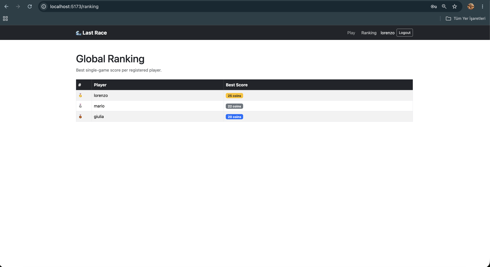
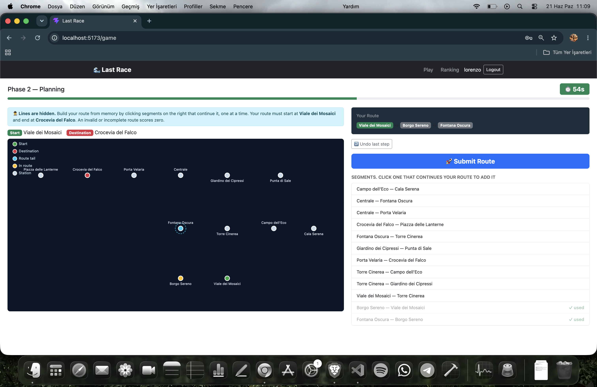

# Exam #1: "Last Race"
## Student: s338142 LEFLEF DAGHAN UFUK 

## How to Run

Open two terminals from the project root.

**Terminal 1: Server**
```bash
cd server
npm install
nodemon index.js
```

**Terminal 2: Client**
```bash
cd client
npm install
npm run dev
```

Then open [http://localhost:5173](http://localhost:5173) in your browser.
The React app runs on port 5173 and talks to the server on port 3001 with direct cross-origin requests (the classic two-servers setup).

---

## React Client Application Routes

- **`/`**: Home page, visible to everyone. Shows the game rules and the "How to Play" cards. Logged-in users also get "Play Now" and "View Ranking" buttons.
- **`/login`**: Login page. Sends you straight to `/game` if you're already logged in.
- **`/game`**: Game page (protected). Runs the full game flow: Setup → Planning → Execution → Result.
- **`/ranking`**: Ranking page (protected). Shows the global leaderboard with each player's best single-game score.

---

## API Server

- **POST `/api/sessions`**: Login. Body: `{ username, password }`. Returns `{ id, username }`, or 401 on failure.
- **DELETE `/api/sessions/current`**: Logout. Returns 204 No Content.
- **GET `/api/sessions/current`**: Returns the logged-in user as `{ id, username }`, or 401 if no one is logged in.
- **GET `/api/network`**: Returns the full network for the Setup phase: `{ lines, stations, segments }`, including line colours. Requires authentication.
- **POST `/api/planning`**: Starts a new game. The server picks a random start/destination pair that's at least 3 segments apart (using BFS), saves the game record, and stores the gameId in the session. Returns `{ gameId, startStation, endStation, segments }` (segments leave out line info here, since the player isn't supposed to know it yet). Requires authentication.
- **GET `/api/events`**: Returns every possible event as `[{ description, effect }]`. Requires authentication.
- **GET `/api/ranking`**: Returns each user's best score as `[{ username, best_score }]`, highest first. Requires authentication.
- **POST `/api/execute-route`**: Validates the submitted route and scores the game. Body: `{ gameId, route: number[] }`. Checks that the game belongs to the caller and matches the session before scoring. Returns `{ valid, finalScore, steps }`. Requires authentication.

---

## Database Tables

- **`users`**: Registered players. Stores `id`, `username`, `hash` and `salt`. Passwords are never stored in plain text, scrypt takes care of that.
- **`stations`**: Individual metro stops (`id`, `name`). Kept separate from lines because interchange stations belong to more than one line.
- **`lines`**: The metro lines themselves (`id`, `name`, `color`).
- **`line_stations`**: Junction table linking stations to lines with an ordered `position`. Two adjacent positions on the same line form a traversable segment. Enforces `UNIQUE(line_id, position)` and `UNIQUE(line_id, station_id)`.
- **`events`**: Random events that affect the coin total during execution (`id`, `description`, `effect`), with `effect` constrained to [-4, +4].
- **`games`**: One row per game attempt. `score IS NULL` while the game is still in progress; once it has an integer score, the game is finished. References `users`, `start_station_id` and `end_station_id`.

---

## Main React Components

- **`App`** (`App.jsx`): Root component. Wraps everything in `UserProvider` and `BrowserRouter`, declares the routes, and renders `NavBar`.
- **`NavBar`** (`components/NavBar.jsx`): The persistent top navigation bar. Shows Play/Ranking links and a Logout button when logged in, or just a Login link otherwise.
- **`ProtectedRoute`** (`components/ProtectedRoute.jsx`): Wrapper component that redirects anyone not logged in to `/login`. Shows a spinner while the initial session check is still running.
- **`NetworkMap`** (`components/NetworkMap.jsx`): The SVG metro map. Draws the coloured line segments with interchange rings during Setup, or a lines-hidden map with start/end highlights and the route trace during Planning.
- **`SetupPhase`** (`components/game/SetupPhase.jsx`): Phase 1 UI. Full coloured network map plus a list of every possible event.
- **`PlanningPhase`** (`components/game/PlanningPhase.jsx`): Phase 2 UI. The 90-second countdown, the lines-hidden map, a clickable segment list for building the route, an undo button, and a live preview of the route so far.
- **`ExecutionPhase`** (`components/game/ExecutionPhase.jsx`): Phase 3 UI. Animated step-by-step reveal of each random event and how it moves the coin balance.
- **`ResultPhase`** (`components/game/ResultPhase.jsx`): Phase 4 UI. Final score, an explanation if the route turned out invalid, and a "Play Again" button.
- **`UserContext`** (`contexts/UserContext.jsx`): React context exposing `{ user, setUser, loading }` to the whole app, set up from a session check on mount.

---

## Screenshots

<!-- Take a screenshot of the Ranking page and save it as img/screenshot-ranking.png -->
<!-- Take a screenshot during an active game (Planning or Execution phase) and save it as img/screenshot-game.png -->
<!-- Then commit the img/ folder and replace the lines below -->




---

## Users Credentials

| Username | Password | Already Played |
|---|---|---|
| mario | password123 | Yes, best score 22 |
| giulia | password123 | Yes, best score 20 |
| lorenzo | password123 | No, not on the ranking until they finish a game |

---

## Use of AI Tools 

I used Claude as a coding assistant for debugging, implementing features, and reviewing code throughout this project.
